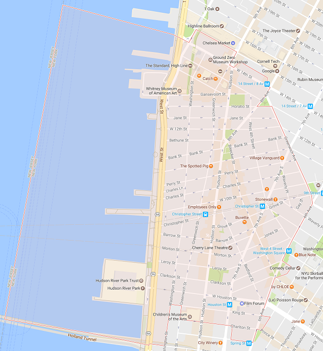

##1. Introduction
Can you spot a trend in new bars and sidewalk cafes? Are we able to predict what the next "up and coming" or gentrified neighborhoods will be? Is there a correlation between the average income of an area and the number of new bars and sidewalk cafes opening up?

Marika lives in Hamilton Heights and noticed that there was a sudden influx of new bars and cafes opening up around her. We wondered whether it would be easy to pick out the 'up and coming' neighborhoods from available data.  

After some research, we decided to use data from data.ny.gov regarding liquor and sidewalk cafe license requests in the four NYC boroughs to determine whether there are any noticeable trends. We did not find any data on new restaurants and bars opening up, but the license requests did seem to be the best proxies since a new bar or restaurant will need a liquor license, and sidewalk cafes need to request special permission to use public street space.  

To better understand why those neighborhoods might be getting popular, we want to compare the data with land values and whatever demographic information we can dig up for those areas. For land values, we'll be using the 2015 NYC Open Data sources for Property Value Data between August 2015 and August 2016. 

We will be limiting our search to the set of zip codes listed on the [NYC Health Website](https://www.health.ny.gov/statistics/cancer/registry/appendix/neighborhoods.htm), which also provides a master set of zip codes and neighborhood names that can be used across datasets. 

The main datasets we will be using are:  
1. [Liquor License Requests](https://data.ny.gov/Economic-Development/NYS-Liquor-Authority-New-Applications-Received/2kid-jvyk/data)  
2. [Currently Active Liquor Licenses](https://data.ny.gov/Economic-Development/Liquor-Authority-Quarterly-List-of-Active-Licenses/hrvs-fxs2)  
3. [Sidewalk Cafe Licences and Requests](https://data.cityofnewyork.us/Business/Sidewalk-Caf-Licenses-and-Applications/qcdj-rwhu)  
4. [Land Values for NYC](https://data.cityofnewyork.us/City-Government/Property-Value-Data-Aug-2015-Aug-2016/xvxg-uxmr)  

Depending on time, we may add additional analysis from healthcode violations and demographics (by zip code) datasets.

##2. Team Section

Rohan Pitre - Will focus on cleaning the data for the liquor license requests and the active liquor licenses and making visualizations of them. Will use ggmap to visualize what areas have active liquor licenses and what areas have made requests for future licenses.

Marika Lohmus - Will focus on the Sidewalk Cafe Licenses and Requests and making visualizations of it. Will use ggmap to visualize where there are currently sidewalk cafes and where they are opening up.

Adam Coviensky - Will focus on obtaining and cleaning data on the wealth per zipcode and creating visualizations from it. Will analyze which neighborhoods are "up and coming" based on wealth data and use ggmap to make visualizations of this.

We will work on combining the data together to form visualizations encompassing all of the variables. If time permits, we will work together to use Shiny to make more interactive visualizations using a map of NYC.

##3. Variable Analysis
#### Sidewalk Cafes
```{r}
library(ggplot2)
library(tidyr)
library(dplyr)
library(forcats)
library(stringr)
```
```{r}
sidewalk_apps<- read.csv("Data/Sidewalk Cafes/Sidewalk_Caf_Licenses_and_Applications.csv")
zip_val_sidewalk <- read.csv("Data/zip_property_values.csv")
master_zip <- read.csv("Data/MASTER_BOROUGHS.csv")
sidewalk_apps$ZIP <- as.factor(sidewalk_apps$ZIP)
sidewalk_apps$CITY <- toupper(sidewalk_apps$CITY)

joined_sidewalk<- merge(sidewalk_apps, master_zip, by="ZIP")

active_sidewalk_apps <- joined_sidewalk %>% filter(LIC_STATUS=="Active")

```

```{r fig.width=10}
ggplot(joined_sidewalk, aes(fct_infreq(Neighborhood)))+geom_bar(aes(fill=LIC_STATUS))+facet_wrap(~Borough, scales='free')+coord_flip()+ggtitle("Active and Inactive Sidewalk Cafe Licenses by Borough")+labs(x="Neighborhood",y="License Count")
```
This set of bar charts analyses the number of active and inactive (requested) licenses by neighborhoods, faceted by borough. This gives an overview of the Neighborhoods we will be concentrating on, and shows the neighborhoods that are most populated with sidewalk cafes. As expected, Manhattan has the most licenses. Out of Mahattan, the Greenwich Village and Soho have the most license requests. In Queens, Northwest Queens takes the lead (which includes Astoria which is known for its many sidewalk cafes). Though it is tougher to see with free axes, Bronx has the least amount of sidewalk cafe requests. 

Focusing on just the Greenwhich Village data, we want to see if there are specific zips which seem to stand out from the rest in terms of unapproved and approved requests.

```{r}
greenwich <- joined_sidewalk %>% filter(str_detect(Neighborhood, "Greenwich"))

ggplot(greenwich, aes(fct_infreq(ZIP)))+geom_bar(aes(fill=LIC_STATUS))+ggtitle("Active and Inactive Sidewalk Cafe Licenses in Greenwich Village and Soho")+labs(x="ZIP",y="License Count")
```
When looking up the 10014 zip code, we get the West part of Greenwich village next to Washington Square Park. This result is quite surprising since the area is not too well known for sidewalk cafes - many restaurants are further East and the Highline is further up north. This will certainly require more investigation.

```{r}
library(knitr)


```

#### Value per zipcode

This data has been processed to have an average revised market value for each zipcode, along with the corresponding borough.

```{r}
zip_values <- read.csv("Data/zip_property_values.csv")
```

Strip plots

```{r}
zip_values %>% ggplot(aes(City, avg_revised_value, color=City, alpha(0.1))) + geom_point(size = 2, shape = 1) + guides(color=FALSE) 
```

In this plot, we can see that Manhattan has the highest average valued zip codes. We see this both in individual values and has a higher distribution. However, the extremes distort the view of the rest of the boroughs so it is difficult to properly compare them to one another.

```{r}
zip_values %>% filter(avg_revised_value < 10000000) %>% ggplot(aes(City, avg_revised_value, color=City, alpha(0.1))) + geom_point(size = 2, shape = 1) + guides(color=FALSE)
```

Here we have filtered the extreme values for Manhattan out of the plot. This allows us to see more clearly how the different boroughs compare to one another. Unfortunately, we only have data on 3 zip codes for Queens and not too many for Staten Island. However, we can clearly see that Bronx and Brooklyn have fairly similar distributions of wealth by their zipcodes only differing by the extreme values. By filtering the data, we find that these two highest values correspond to Brighton Beach and Brooklyn Heights. Surprisingly enough, Williamsburg was actually towards the bottom of this list. This is likely because the there is no data on dollar per square footage in this dataset and the places in Williamsburg are likely smaller buildings.


Barchart of counts

```{r}
ggplot(zip_values, aes(x=reorder(City, -table(City)[City]))) + geom_bar() + xlab("City") + ylab("Number of Zipcodes") + ggtitle("Number of zipcodes with observations per borough")
```

This bar chart indicates how many zipcodes we have data on from each borough. We are clearly lacking data on wealth for a lot of zipcodes in Queens and possibly even Staten Island. However, this will only be an issue if we also have data on many restaurants in these zipcodes. If these are much more residential areas and most of the restaurants popping up are in the zipcodes we do have data on, then it should not be an issue. Otherwise, this plot indicates that we might have to find more data.

Barchart of means

```{r}
zip_values %>% group_by(City) %>% summarise(avg_per_city = mean(avg_revised_value)) %>% ggplot(aes(x = reorder(City, -avg_per_city), y = avg_per_city)) + geom_bar(stat = "identity") + xlab("Borough") + ylab("average market value") + ggtitle("Mean Market Value by Borough")
```

Again here we can see that Manhattan has by far the greatest average market value as expected. Furthermore, the other boroughs all seem pretty similar except for Staten Island which sees a somewhat significant drop.

Barchart of medians
```{r}
zip_values %>% group_by(City) %>% summarise(median_per_city = median(avg_revised_value)) %>% ggplot(aes(x = reorder(City, -median_per_city), y = median_per_city)) + geom_bar(stat = "identity") + xlab("Borough") + ylab("Median Market Value") + ggtitle("Median Market Value by Borough")
```

When looking at the medians, it appears that Manhattan is not as far off from the rest of the boroughs indicating that there are indeed some outliers which we saw in the point graph above. Furthermore, the drop in Staten Island is now even more evident since there was one outlier.

Histogram of Revised values per zip code:

```{r}
zip_values %>% filter(avg_revised_value < 10000000) %>% ggplot(aes(avg_revised_value)) + geom_histogram(bins = 10) + scale_x_continuous(limits = c(50000, 10000000)) + ggtitle("Histogram of values") + ylab("Count") + xlab("Average Revised Value")
```

This shows that the distribution is very high towards the lower end of the revised value per zip and there are fewer and fewer as the values increase. This was expected and is due to the fact that all five boroughs are highly concentrated around the lowest two bins whereas Manhattan has many higher market valued zip codes as well as illustrated by the strip plot.